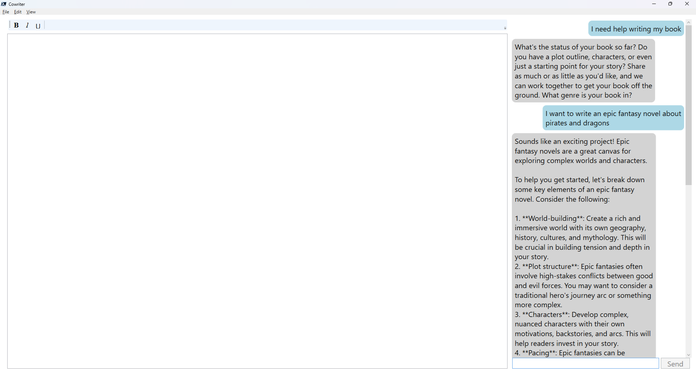

# Cowriter

An AI for authors.

## Overview

Cowriter is a local AI writing assistant built on PowerShell and Ollama. Authors can use Cowriter to help develop their work, adjust the writing style, and provide suggestions or critiques.

## Install

For easy installation, download the [setup script](./src/cowriter/scripts/SetupCowriter.ps1). Once downloaded, right-click and select "Run with PowerShell".

Alternatively, launch PowerShell and run from the console:

```powershell
& C:\path\to\SetupCowriter.ps1
```

## Using

To use Cowriter, open PowerShell and run:

```powershell
Import-Module cowriter
Start-Cowriter
```


